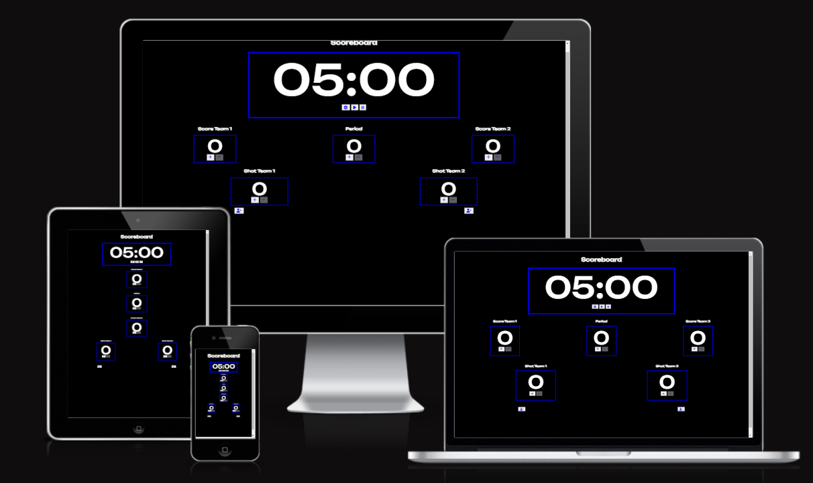
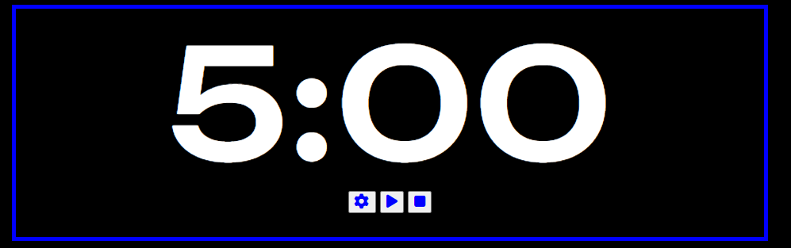
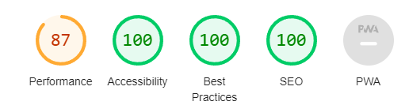

# Hockey Score Board

## Features

The website is a simple ball hockey Score board with program time for each period. The user can add the rooster in the bottom of the score board at the beginning of the game. Once the game has started, the user can easily stop and play the timer, add/remove goal to/from a team, add/remove shot to/from each team. The timer can also be modified manually to accomodate different time rules.

### Existing Features

__Timer__

- The timer is the biggest object in the page to ensure all players can see the time. The timmer has 3 functions:
    - Set Time: By click on the setting button, the user can modify the time. If the value of second exceed 60, a error message is sent to the user. If the value of minutes exceed 100, a alert message is sent to the user telling him that the game is way too long but the command is still executed to accomodate user who would like to set up the timer for a 2 hours free play by example.
    - Play time: The timer start going down by one second for every tick.
    - Stop time: The timer stop ticking.

- This feature doesn't open the page in a different tab and all the pages has it. This is to ensure easy navigation between the pages.

__Home page welcome image__

- Period 0 has 5 minutes timer to give some time to the player to practice there shot. Period 1,2 and 3 have 10 mins to accomodate most if the ball hockey league time rules. Period 4 has 5 mins

__what is crypto Section__

- This section is to explain in a very general view what is cryptocurrency.

- A picture on the side has been put to catch the eyes of the viewer in an original way. The text is on the left and picture on the right. You will find the opposite set up in the section "Type of token".

__Three sections__

- This section explains 3 really important definition that are not always understood in the crypto world. 

- The definitions are shorts and aim to get the viewers curious about the subject. A future update of the website aim to add more details on those concepts.

__type of token__

- this token is an introduction to the list of the token below it.

- It aims to catch the eye and like the "What is crypto section" show the website in an original way. As mentioned above, the text and image are opposite to the other section.

__list of token__

- The list of token follows the same pattern, alternating right to left.

- The description are shorts and aim to get the viewers curious about the subject. Most of them have example so the viewers can understand better the concept and start to know some of the tokens.

__footer__

- The footer has 4 useful links: Coinmarketcap (Coins encyclopaedia), Binance (Platform), Coinbase (Platform) and Ledger (Solution to store crypto safely). 

- Copyright have also been added into the footer.

__Buy Crypto welcome image__

- The image catches the eyes as it connects us dollars and bitcoin. It makes total sense as the next section on the page will be explaining how to buy crypto with a currency.

__Buy using an exchange__

- This section explains that the best way to buy crypto is by exchanges. It shows how important to do research about the exchanges before choosing it.

- Three criteria are elaborated in this section which are also shown in the table below.

__Exchange table__

- To catch the eyes of the viewers and show the details of every exchange in a easy and simple way, a table is shown.

- Four data are shown in the table: exchange's name, overall rating, financial reserve and deposit bonuses.

- The viewers understand straight away the table has the data has been explained in the section just above it.

__Report a scam image__

- The welcome page covers all the whole page and catch the eyes as it is a bitcoin in the dirt. The dirt represents the though feeling of losing money and being caught in a scam.

__Report a scam form__

- The form has four entries: First name, Last name, Scam Description, and platform which the scam has happened.

- The reports are put in the database. In a future update of the website, the scams will be shown on the website and an easy search option will be featured for anybody to check if they are going to the same scam that someone else has reported.

### Features left to implement

- The database of the scams shown directly on the website.

- A search feature to find a scam from the database.

- A additional page explaining the main scams that are around in the crypto world.

## Testing

You can find below that all testing has been completed.

### Validator Testing

- HTML validator have been completed and all errors and warnings have been fixed.

- CSS validator have been completed and no errors or warnings have been found.

- Lighthouse has been run through all the pages, see the below result:

- The performance is the only assessment which has not achieved 100 points. Two main factors explain the lack of performance:

    - The size of the images is the main problem as it takes too long for the images to load. Smaller resolution of images should have been used for the website. This was the main problem of the performance and only that change would have boosted greatly the performance.
    - The CSS files is too heavy. To achieve a perfect performance, CSS file should have been optimised.

### Unfixed Bugs

 - All bugs have been fixed. Performance could be upgraded by using smaller resolution pictures and by optimizing the CSS file.

## Deployment

- The website has been deployed using Github following the below steps
    -  The files have been prepared using Gitpod
    -  The files have been pushed to Github using Git commands
    -  The correct files in the repositories have been selected
    -  In the setting / page, the source has been put on "Deploy from a branch" and the branch on "main" then click save
    -  The website is now deployed

The live link can be found here: https://vincentbergeron33.github.io/How-to-avoid-scam-in-Crypto-world/

## Credits

- Code ideas have been taken from the Love Running Website. The codes were never copy/paste. They were developed to follow the configuration of the website.

- Investopedia was used as a reference for the rating of the exchanges.

- Coinmarketcap was used for the financial reserve for the exchanges.

### Content

- The icons in the navigation menu and the scam form were taken from [Font Awesome](https://fontawesome.com/).

- The font family were taken from [Google Fonts](https://fonts.google.com)

### Media

- All pictures were taken from [Pexels](https://www.pexels.com/)

