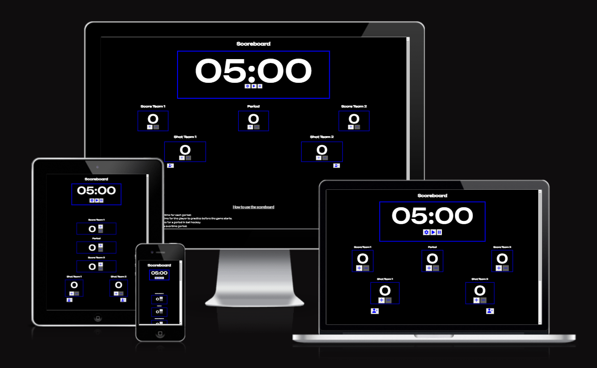
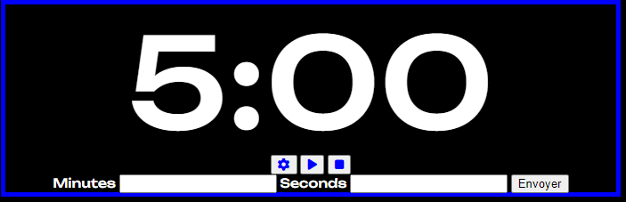

# Hockey Score Board

The website is a useful scoreboard. The scoreboard is set to the ball hockey timing rules but can easily use for any kind of sports as the functions have been developed to accept all kind of data numbers. It has been designed to be simple and easy to use for the user. In case the user did a mistake, he/she can easily correct it by clicking to the opposite button. It fits for all size of media, but I strongly suggest using a desktop so the user can share his screen on a tv by example so all players can see the time running down.

## Features

The website is a simple ball hockey Score board with program time for each period. The user can add the rooster in the bottom of the score board at the beginning of the game. Once the game has started, the user can easily stop and play the timer, add/remove goal to/from a team, add/remove shot to/from each team. The timer can also be modified manually to accommodate different time rules.

### Existing Features

__Timer__

- The timer is the biggest object in the page to ensure all players can see the time. The timer has 3 functions:
    - Set Time: By click on the setting button, the user can modify the time. The value for the minutes is unlimited but the value for the seconds is limited between 0 and 59.
    - Play time: The timer starts going down by one second for every tick. When the page loads, the pause button is disabled. When the play button is clicked, it becomes disabled and, the pause button is abled.
    - Pause time: The timer stops ticking. Once the pause button is clicked, it becomes disabled, and the play button is abled.

__Goal panel__

- The goal panels are shown on each side for each team. The user can add/remove a goal to/from each team. When the value is 0, the minus button is disabled.

__Period Panel__

- The period panel is between the goal panel of each team. It is initially set to 0 and 5 minutes on the timer. When the user increases the period to 1,2 & 3, the time will be set to 10 minutes. When the user increase to period 4 and the time is set to 5 mins. This is to represent a free play at the period 0 for player to practice shots and goalkeeper to warm up. Then the periods start which are 10 minutes in normal hockey ball league. The period 4 represent an overtime which are normally 5 minutes. When the value is 0, the minus button is disabled.

__Shot panel__

- The shot panels are shown on each side for each team. The user can add/remove a shot to/from each team. When the value is 0, the minus button is disabled.

__Rooster Panel__

- The Rooster panels are shown on each side for each team. The user can add the rooster of each team. When the button is clicked, a form is added to the div setting. 3 entries are required before submitting the form: the player #, player first name and player last name. Once submitted, the form is removed from the div setting the information of the player are added to the div rooster. The rooster ppanel is disabled while filling the form to avoid adding multiple form to the score board.

### Features left to implement

- A penalty panel will be implemented in a future version. The penality panel will add the player number with the time he is on penalty. Once the button in the Timer panel play is clicked, the time of the penalty would also start. When the the is egal to 0:00, the block is removed.

- A function to the goal panel will be implemented in a future version where the user can enter when a team score the details of the player who scored and the player who did the pass to the scorer. Those data will be kept in a database for the next function.

- At the end of the game, the statistic of the game will be sent in a format that shows who won the game, the details of each goal (Scorer + passer) and the number of shot for each team. 

## Testing

You can find below that all testing has been completed.

### Page testing

__Timer testing__

- The play & pause button have been tested. Once the play button is clicked, it is disabled and only the pause button is abled. Once the pause button is clicked, it is disabled and the play button is abled.

- The setting button becomes disabled once click to ensure a maximum of one form is created. Once the form is submitted to change the time, it becomes abled.
;

- The seconds in the set timer form is limited to 59 and it will send back an error is the user pt a value higher than 59.

- The second and minutes are always showing with a minimum of 2 numbers in the timer. If a value of 8 mind and 0 seconde is entered in the set timer form, it will show a value of 08:00.

__Goal, Period and Shots__

- The number of the goals, period and shots can never go below 0 as the minus button is disabled when the value is egal to 0.

__Rooster__

- The rooster setting buttons follow the same logic as the set time button of the timer. Once clicked, it is disabled to ensure the user doesn't create more then one form. Once the required informations are filled, the form is deleted, the entry is added to the rooster and the rooster setting button is abled.

### Validator Testing

- HTML validator have been completed and all errors and warnings have been fixed.

- CSS validator have been completed and no errors or warnings have been found.

- Lighthouse has been run through all the pages, see the below result:

- The performance is the only assessment which has not achieved 100 points. Two main factors explain the lack of performance: 
    - The CSS file is too heavy. To achieve a perfect performance, CSS file should have been optimised.
    - The JS file is too heavy. To achieve a perfect performance, JS file should have been optimised. The use of library would greatly improve the performance.

### Unfixed Bugs

 - All bugs have been fixed. Performance could be upgraded by optimizing the CSS & JS files.

## Deployment

- The website has been deployed using Github following the below steps
    -  The files have been prepared using Gitpod
    -  The files have been pushed to Github using Git commands
    -  The correct files in the repositories have been selected
    -  In the setting / page, the source has been put on "Deploy from a branch" and the branch on "main" then click save
    -  The website is now deployed

The live link can be found here: https://vincentbergeron33.github.io/Score-Board/

The website has been deployed when all functions were tested and were working. From the deployment, CSS validor, HTML validator and AMIRESPONSIVE have been run through the website.

## Credits

- The project idea came from a request of my brother who would like his ball hockey website to be updated. The colours represent his hockey league colours.

- The coding itself was developed using the tool of the course. For details how to run specific functions, the website Stack Overflow was a great help. Please note that no code has been copy/paste from any website. The website was only a tool to understand the mechanic of the code.

### Content

- The icons in the navigation menu and the scam form were taken from [Font Awesome](https://fontawesome.com/).

- The font family were taken from [Google Fonts](https://fonts.google.com)

### Media

- Non-applicable.

